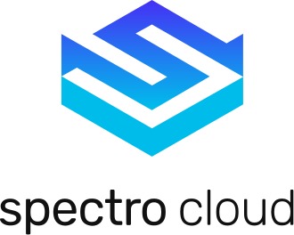

<a href="https://github.com/actions/typescript-action/actions"></a>

# Spectro Cloud Kubernetes

<p align="center">

</p>

This action can be used to set the Kuberentes context for Spectro Cloud clusters.

The action will retrieve the latest available Kubeconfig for the target K8s cluster and set the context as appropriate.

## Action inputs

<table>
  <thead>
    <tr>
      <th>Action inputs</th>
      <th>Description</th>
    </tr>
  </thead>
  <tr>
    <td><code>host</code><br/>Host</td>
    <td>(Optional) Spectro Cloud API endpoint. Default points to the Spectro Cloud SaaS endpoint: api.spectrocloud.com</td>
  </tr>
  <tr>
    <td><code>username</code><br/>Username</td>
    <td>Spectro Cloud Username (e.g: user1@abc.com)</td>
  </tr>
  <tr>
    <td><code>password</code><br/>Password</td>
    <td>Spectro Cloud Password (e.g: superSecure1#)</td>
  </tr>
  <tr>
    <td><code>projectName</code><br/>Project Name</td>
    <td>Name of the project where the K8s cluster is running, e.g: Default</td>
  </tr>
  <tr>
    <td><code>clusterName</code><br/>Cluster Name</td>
    <td>Name of the K8s cluster, e.g: cluster1</td>
  </tr>
</table>

## Example usage

```yaml
- uses: spectrocloud/k8s-set-context@v1
  with:
    host: {enter Spectro Cloud API Endpoint (optional)}
    username: {enter user's Spectro Cloud Username}
    password: {enter user's Spectro Cloud Password}
    projectName: {enter Spectro Cloud Project Name}
    clusterName: {enter Spectro Cloud K8s cluster name}
  id: setcontext
```

**Please note** that all input except `host` are required.


## Support

Refer to the [Spectro Cloud Documentation](https://docs.spectrocloud.com) for more information on how to 
retrieve the required properties.

Please file a GitHub issue for any support or questions regarding the integration.
